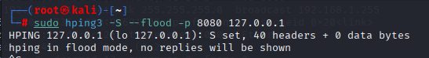
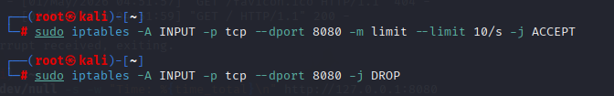
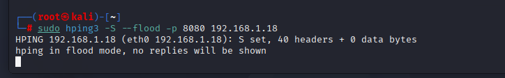

# DoS Attack Simulation & Network Defense Analysis

## 📌 Project Overview
This project demonstrates a controlled Denial-of-Service (DoS) attack simulation to analyze network traffic patterns and evaluate host-based firewall mitigation strategies. The lab focuses on the exploitation of the TCP Three-Way Handshake and subsequent mitigation using Linux kernel firewalls.

## 🛠️ Tools Used
* **Primary Platform:** Kali Linux
* **Attack Tool:** hping3 (TCP SYN Flood)
* **Analysis:** Wireshark & htop
* **Defense:** iptables (Rate Limiting)[cite: 2]

## 🛡️ Key Technical Concepts
### 1. TCP SYN Flood Mechanism
The attack exploits the "Three-Way Handshake" by sending a continuous stream of SYN packets without responding to the server's SYN-ACK[cite: 2]. This exhausts the server's SYN_RECV queue, leading to resource depletion and service refusal[cite: 2].

### 2. Network Traffic Analysis
Using Wireshark, I identified critical indicators of the attack:
* High frequency of **SYN packets** targeting port 8080[cite: 2].
* **RST, ACK flags** sent by the server, indicating connection resets due to backlog saturation[cite: 2].
* Distribution analysis showing traffic originating from thousands of randomized IPs via the `--rand-source` flag[cite: 2].

## 📸 Project Gallery

| 1. Attack Simulation | 2. Network Analysis |
| :---: | :---: |
|  |  |
| *Launching the SYN Flood via hping3* | *Analyzing Randomized Source IPs in Wireshark* |

| 3. Mitigation Strategy | 4. Final Results |
| :---: | :---: |
|  | [Full Report Link](./DoS%20Attack%20Simulation%20&%20Analysis.pdf) |
| *Implementing iptables Rate-Limiting* | *Click to view complete technical documentation* |

## 🧱 Mitigation Strategy
I implemented a proactive defense using **iptables** to rate-limit incoming TCP connections[cite: 2].
```bash
# Rate-limit incoming TCP packets to 10 per second
sudo iptables -A INPUT -p tcp --dport 8080 -m limit --limit 10/s -j ACCEPT
sudo iptables -A INPUT -p tcp --dport 8080 -j DROP
